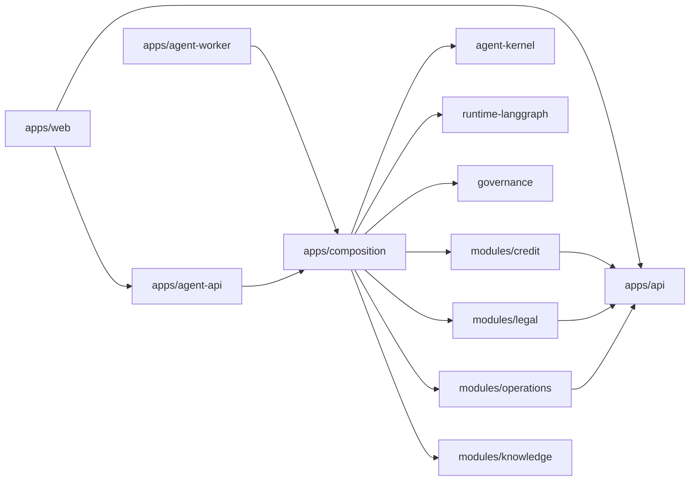

# Project Structure — Digital Expert Agents

Ownership and dependency direction. Source code lands inside these folders
after stories are selected; until then folders are skeleton-only.

[`docs/architecture/index.md`](docs/architecture/index.md) · [`AGENTS.md`](AGENTS.md)

## Tree

```text
.
├── AGENTS.md / CLAUDE.md / README.md / STRUCTURE.md
├── apps/
│   ├── web/                    # Next.js: chat + orchestration dashboard
│   ├── api/                    # NestJS: banking domain + /v1/agent/* bridge
│   ├── agent-api/              # FastAPI: run start/status/stream/cancel
│   ├── agent-worker/           # LangGraph host: planner + specialists
│   └── composition/            # Wire modules + adapters (agent side)
├── packages/
│   ├── contracts/              # Shared Zod/OpenAPI DTOs (web ↔ api)
│   ├── design-tokens/          # UI tokens
│   ├── agent-kernel/
│   │   ├── contracts/          # Pure DTOs: ExecutionContext, CanonicalEvent
│   │   ├── application/        # Run lifecycle orchestration
│   │   └── ports/              # Runtime, memory, checkpoint, approval, audit
│   ├── runtime-langgraph/      # Graph, checkpoint, interrupt/resume
│   ├── runtime-langchain/      # Adaptive tool loop adapter
│   ├── governance/             # Policy, HITL, budgets, allowlists
│   ├── shared-retrieval/       # Retrieve/rerank
│   ├── shared-embeddings/      # Embedding providers
│   ├── shared-types/
│   └── shared-testing/
├── modules/
│   ├── credit/                 # Credit domain + agent-tools
│   ├── legal/                  # Legal/compliance domain + agent-tools
│   ├── operations/             # Operations domain + agent-tools
│   ├── knowledge/              # Tenant KB + RAG contribution
│   └── identity/               # Optional identity/RBAC bindings
├── config/
│   ├── agents/                 # Filled agent contracts (YAML)
│   ├── prompts/                # Versioned prompts per agent
│   ├── policies/               # HITL, tool allowlists, budgets
│   └── knowledge/              # Corpus routing config
├── data/
│   ├── seed/                   # Mock SHB banking data
│   └── knowledge/{credit,legal,operations}/
├── docs/
│   ├── architecture/
│   ├── harness/                # Operating model + per-part harness
│   ├── product/
│   ├── stories/
│   ├── templates/
│   └── demo/
├── templates/                  # Architecture form templates
├── scripts/                    # harness schema + CLI hooks
├── infra/
└── tests/{contract,integration,e2e}/
```

## Ownership

| Area | Owner | Owns | Must not own |
|---|---|---|---|
| `apps/web` | Frontend | Chat UI, dashboard, traces viz | Business rules, tool dispatch |
| `apps/api` | Backend | Banking domain, `/v1/agent/*` bridge | Agent planning, LangGraph state |
| `apps/agent-api` | Agent platform | HTTP channel for runs/stream | Domain aggregates |
| `apps/agent-worker` | Agent platform | Graph execution host | Product DB schema |
| `apps/composition` | Platform | DI/wiring registry | HTTP handlers, domain rules |
| `packages/agent-kernel` | Platform | Contracts, ports, lifecycle | Feature DB |
| `packages/runtime-*` | Platform | Framework adapters | Domain imports |
| `packages/governance` | Security/platform | Policy, HITL, budgets | Prompt-only enforcement |
| `modules/*` | Domain | Business truth + tool closures | Runtime orchestration |
| `config/*` | Designated owners | Reviewed policies/prompts/contracts | Secrets |

## Dependency direction



Rules:

1. Ports do not import adapters; application does not import LangGraph directly.
2. Tool closures call NestJS `/v1/agent/*` (or public module surfaces) with
   scoped service tokens — never user cookies.
3. Product state and approvals are owned by platform/domain; LangGraph
   checkpoints are execution recovery only.
4. Domain callee re-checks tenant/RBAC on every tool invocation.
