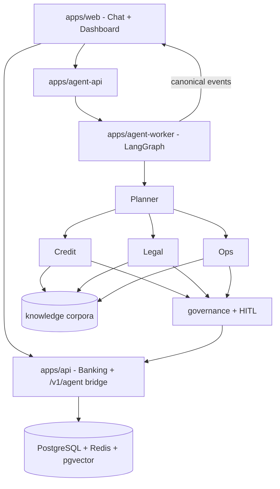

# Architecture (one-pager)

Digital Expert Agents separates **business decision ownership** from **agent
runtime mechanisms**. Models propose and plan; the platform owns identity,
policy, product state, approvals, audit, and side effects.

## Non-negotiables

1. Runtime framework is not system of record.
2. All access is tenant-scoped; domain re-checks authz.
3. Write tools need approval by risk, idempotency, immutable audit.
4. Checkpoint ≠ durable business memory.
5. Prompts do not hold business rules that must be correct — put those in testable code/tools.
6. Agents never hold user session cookies.
